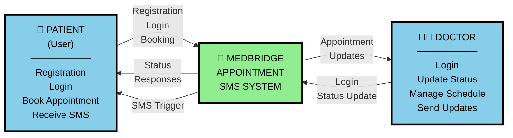
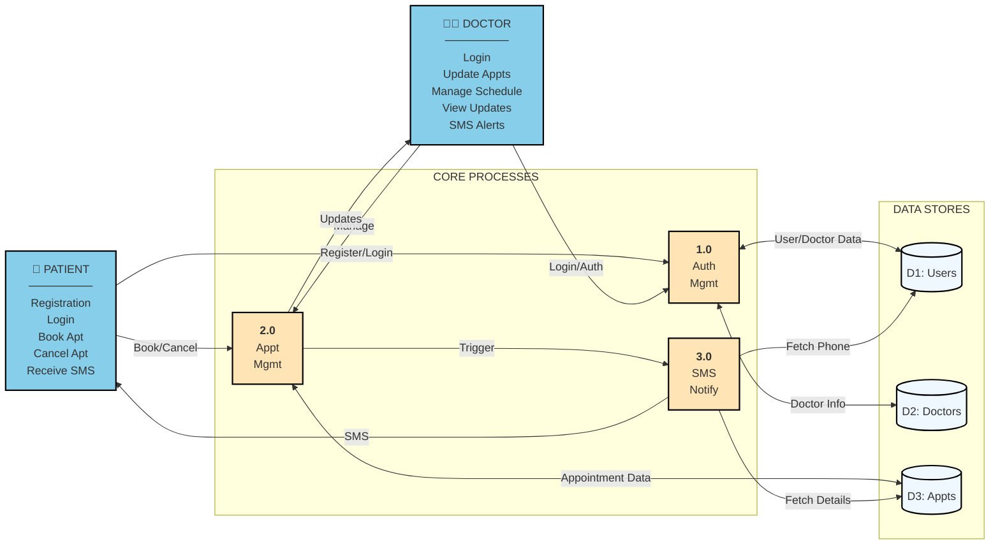
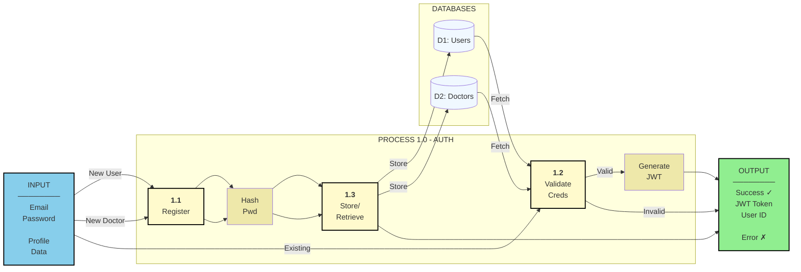
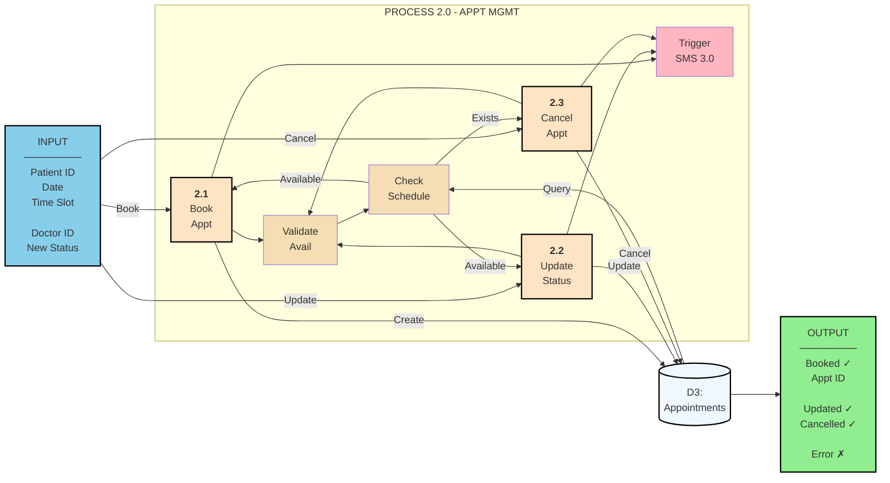
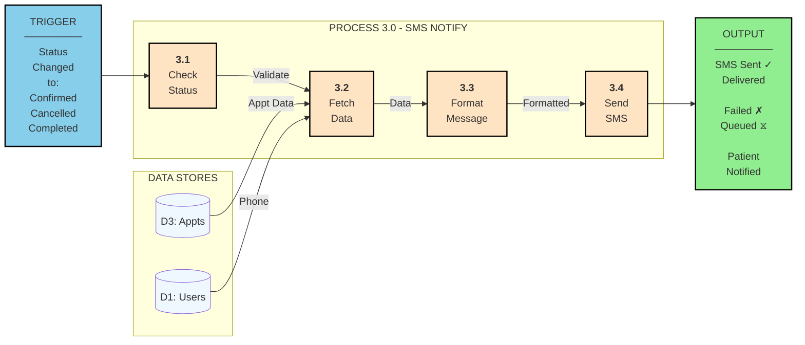
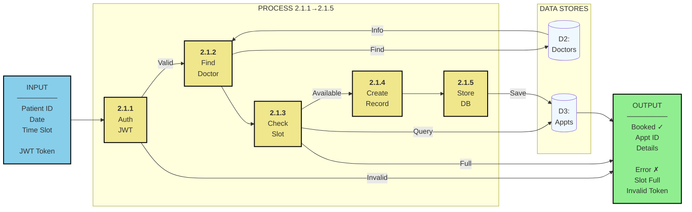
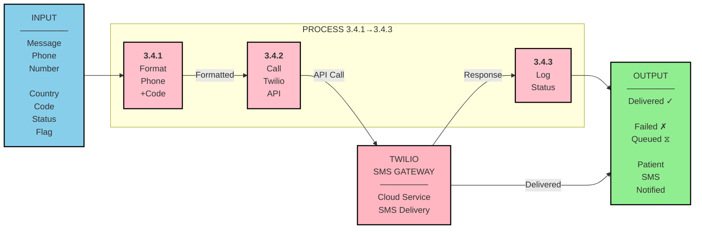
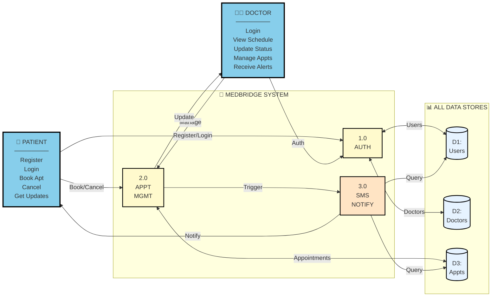

# MediBridge — DFD Visual Diagrams (Mermaid)

## 0-Level DFD (Context Diagram)

---

## 1-Level DFD (Main Processes & Data Stores)

---

## 2-Level DFD - Process 1.0 (Auth Management)

---

## 2-Level DFD - Process 2.0 (Appointment Management)

---

## 2-Level DFD - Process 3.0 (Notification Service)

---

## 3-Level DFD - Process 2.1 (Book Appointment)

---

## 3-Level DFD - Process 3.4 (Send SMS via Twilio)

---

## Complete Data Flow Mapping (All Levels Summary)

---

## Process Description Table

| Process | Input | Output | Data Stores |
|---------|-------|--------|-------------|
| **1.0 Auth** | Email, Password | JWT Token / User ID | D1, D2 |
| **2.1 Book** | Patient ID, Date, Slot | Appointment ID | D2, D3 |
| **2.2 Update** | Appointment ID, Status | Updated Record | D3 |
| **2.3 Cancel** | Appointment ID | Cancelled Record | D3 |
| **3.1 Check** | Status Trigger | Status Validation | D3 |
| **3.2 Fetch** | Appointment ID | Patient + Appt Data | D1, D3 |
| **3.3 Format** | Status + Data | SMS Message | - |
| **3.4 Send** | Phone + Message | SMS Sent Status | Twilio |

