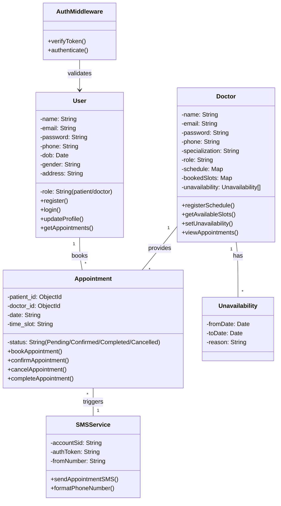
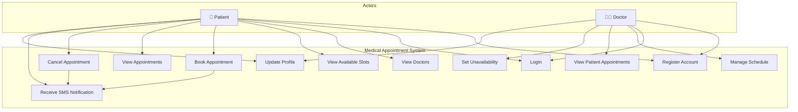
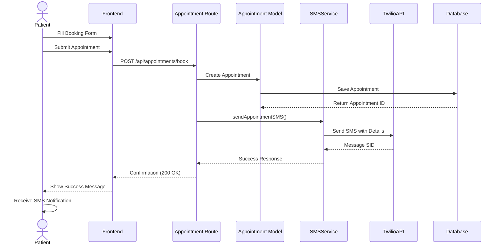
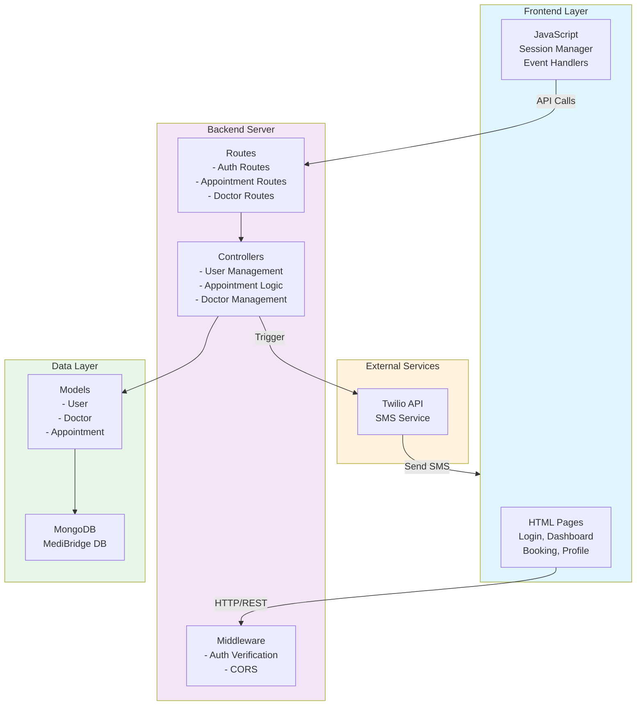
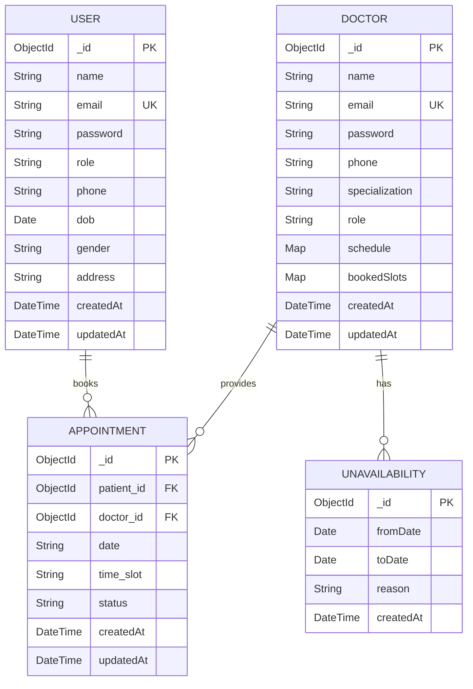
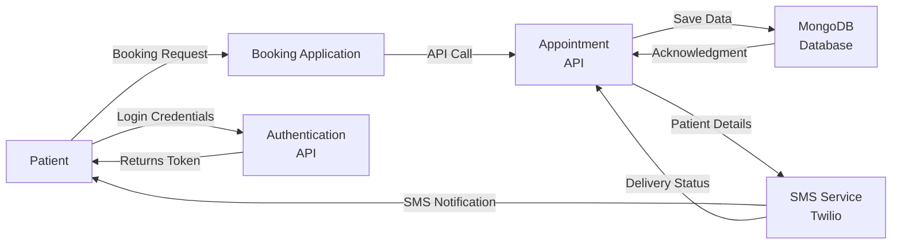

# UML Diagrams - Medical Appointment & SMS Notification System

## Project Overview
This document contains complete UML diagrams for the Medical Appointment System with SMS notifications. The system allows patients to book appointments with doctors and receive SMS confirmations via Twilio.

---

## 1. CLASS DIAGRAM
Shows the structure of all classes and their relationships.



### Class Relationships:
- **User (1) -- (*) Appointment**: One user can have multiple appointments
- **Doctor (1) -- (*) Appointment**: One doctor can have multiple appointments
- **Doctor (1) -- (*) Unavailability**: One doctor can have multiple unavailability periods
- **Appointment (*) --> (1) SMSService**: Appointments trigger SMS notifications
- **AuthMiddleware --> User**: Validates user authentication

---

## 2. USE CASE DIAGRAM
Shows all interactions between actors (Patient/Doctor) and the system.



### Patient Use Cases:
- Register Account
- Login
- View Doctors
- View Available Slots
- Book Appointment
- View Appointments
- Cancel Appointment
- Receive SMS Notification
- Update Profile

### Doctor Use Cases:
- Register Account
- Login
- Manage Schedule
- View Patient Appointments
- Set Unavailability
- Update Profile

---

## 3. SEQUENCE DIAGRAM
Shows the step-by-step flow of booking an appointment.



### Flow Steps:
1. Patient fills the booking form
2. Frontend submits POST request to API
3. Appointment Route processes the request
4. Appointment is created in the model
5. Data is saved to MongoDB
6. SMS Service is triggered
7. Twilio API sends SMS to patient's phone
8. Success response is returned to frontend
9. Patient receives confirmation message and SMS

---

## 4. SYSTEM ARCHITECTURE DIAGRAM
Shows the overall system architecture and component layers.



### Architecture Layers:
1. **Frontend Layer**: HTML pages and JavaScript logic
2. **Backend Server**: Express.js with routes, middleware, and controllers
3. **Data Layer**: MongoDB models and database
4. **External Services**: Third-party APIs (Twilio for SMS)

---

## 5. ENTITY RELATIONSHIP DIAGRAM (ERD)
Shows database schema and relationships.



### Database Tables:

#### USER Table
- **_id**: Primary Key (ObjectId)
- **name**: User's full name
- **email**: User's email (Unique)
- **password**: Hashed password
- **role**: "patient" or "doctor"
- **phone**: User's phone number
- **dob**: Date of birth
- **gender**: Male/Female/Other
- **address**: User's address
- **createdAt**: Record creation timestamp
- **updatedAt**: Record last update timestamp

#### DOCTOR Table
- **_id**: Primary Key (ObjectId)
- **name**: Doctor's name
- **email**: Doctor's email (Unique)
- **password**: Hashed password
- **phone**: Doctor's phone
- **specialization**: Medical specialization
- **role**: Always "doctor"
- **schedule**: Map of available slots per date
- **bookedSlots**: Map of booked slots per date
- **createdAt**: Record creation timestamp
- **updatedAt**: Record last update timestamp

#### APPOINTMENT Table
- **_id**: Primary Key (ObjectId)
- **patient_id**: Foreign Key to USER
- **doctor_id**: Foreign Key to DOCTOR
- **date**: Appointment date
- **time_slot**: Appointment time
- **status**: Pending/Confirmed/Completed/Cancelled
- **createdAt**: Record creation timestamp
- **updatedAt**: Record last update timestamp

#### UNAVAILABILITY Table
- **_id**: Primary Key (ObjectId)
- **fromDate**: Start of unavailable period
- **toDate**: End of unavailable period
- **reason**: Reason for unavailability
- **createdAt**: Record creation timestamp

---

## 6. DATA FLOW DIAGRAM



---

## How to Use These Diagrams

### Option 1: View in Markdown Viewer
- Copy the Mermaid code blocks
- Paste into any Markdown viewer that supports Mermaid (GitHub, GitLab, Notion, etc.)

### Option 2: Generate Images
1. Visit [Mermaid Live Editor](https://mermaid.live/)
2. Copy each diagram code
3. Paste into the editor
4. Export as PNG or SVG
5. Save to your documentation folder

### Option 3: In VS Code
1. Install "Markdown Preview Mermaid Support" extension
2. Open this file in VS Code
3. Preview the markdown to see rendered diagrams

### Option 4: In Word Document
1. Use an online Mermaid to image converter
2. Run images through a Word document template
3. Add text descriptions from this file

---

## Key Components Summary

| Component | Purpose | Technology |
|-----------|---------|-----------|
| **User Model** | Stores patient and doctor information | MongoDB + Mongoose |
| **Doctor Model** | Manages doctor profiles, schedules, and availability | MongoDB + Mongoose |
| **Appointment Model** | Tracks appointment bookings and status | MongoDB + Mongoose |
| **Auth Middleware** | Verifies user authentication on API routes | Node.js/Express |
| **SMS Service** | Sends appointment notifications to patients | Twilio API |
| **Frontend** | User interface for booking and profile management | HTML/CSS/JavaScript |
| **Express Server** | REST API backend | Node.js + Express |

---

## API Endpoints

```
POST   /api/auth/register          - Register new account
POST   /api/auth/login             - User login
GET    /api/appointments           - Get user's appointments
POST   /api/appointments/book      - Book new appointment
PUT    /api/appointments/:id       - Update appointment
DELETE /api/appointments/:id       - Cancel appointment
GET    /api/doctor                 - Get all doctors
PUT    /api/doctor/schedule        - Update doctor schedule
POST   /api/doctor/unavailability  - Set unavailable dates
```

---

## Document Information
- **Project**: Medical Appointment & SMS Notification System
- **Created**: February 2026
- **Database**: MongoDB (MediBridge)
- **Backend**: Node.js + Express
- **Frontend**: HTML5 + CSS3 + JavaScript
- **External Service**: Twilio API for SMS

---

## Notes for Documentation
- All diagrams are in Mermaid format for easy editing and conversion
- Use the Class Diagram for technical documentation
- Use the Use Case Diagram for stakeholder presentations
- Use the Sequence Diagram for technical workflows
- Use the ERD for database documentation
- All diagrams include detailed descriptions below each one
